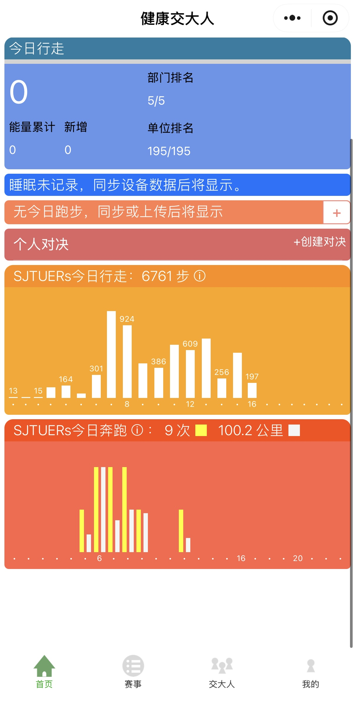
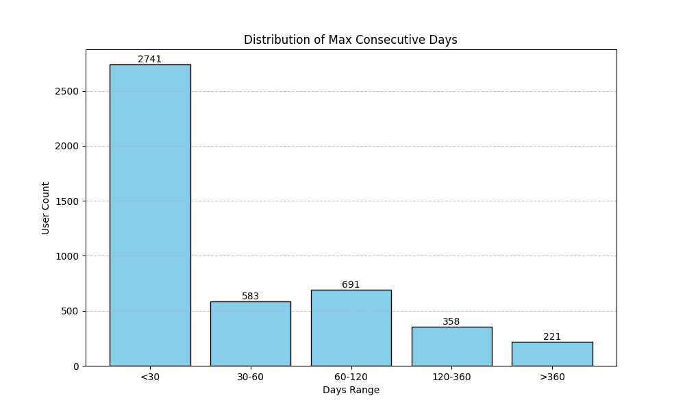
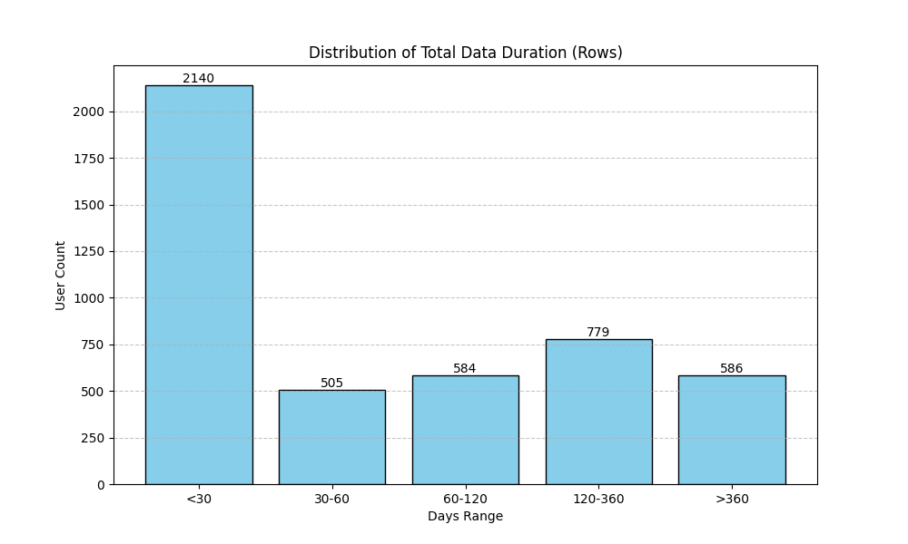

# Human-Physical-Activity-HPA-dataset

A time series dataset containing daily step counts from Shanghai Jiao Tong University (SJTU)

[](https://creativecommons.org/licenses/by-nc/4.0/)

## 📖 Overview

This dataset comprises high-resolution step count data collected from the **SJTU Health Mini-program** (健康交大人小程序), developed by **Prof. Weiqiang Sun** and his team at Shanghai Jiao Tong University.

Since 2017, the platform has accumulated data from **4,594 users**. The dataset focuses on daily physical activity tracking and has been strictly anonymized to protect user privacy. All data collection was conducted with explicit user consent.

> **Principal Investigator:** [Prof. Weiqiang Sun](https://icisee.sjtu.edu.cn/jiaoshiml/sunweiqiang.html)  
> [Google Scholar](https://scholar.google.com/citations?hl=zh-CN&user=2ezpfqcAAAAJ)

### 📱 Data Source Interface


---

## 📂 Dataset Structure 

The dataset involves two primary categories of data organization:

### 1. Yearly Aggregated Data (Raw/Sparse)
Found in the year-specific folders (e.g., `2017/`, `2018/`, ..., `2023/`).
* **Time Span:** 2017 to 2023 (Latest data is currently being processed).
* **Characteristics:** These files contain raw data from all users. The data is **sparse** and may contain missing values (NaN) due to user inactivity or device switching.

### 2. High-Quality Continuous Data
Found in the `ContinuousData/` directory.
* **Population:** 189 selected users.
* **Criteria:** Users with continuous usage for **>120 days**.
* **Granularity:** 15-minute intervals.
* **Quality:** No loss, high continuity. Ideal for time-series forecasting and pattern recognition research.

---

## 📝 Data Format & Device Logic

The data files typically follow this column structure:

| Column Index | Column Name | Description |
| :--- | :--- | :--- |
| **Col 1** | `Date` | Timestamp of the record (YYYY-MM-DD). |
| **Col 2** | `Type` | Source device (Android, iOS, Huawei, etc.). |
| **Col 3+** | `Step_Counts` | Step count data points corresponding to specific timestamps. |

### ⚠️ Critical Note on Device Sampling Logic
Different mobile operating systems handle step counting differently. **You must apply specific preprocessing based on the `Type` column:**

1.  **🤖 Android Devices:**
    * **Behavior:** Sampling is irregular.
    * **Handling:** Missing data indicates actual missing records (e.g., background process kill or sensor failure). Treat as `NaN` or missing.

2.  **🍎 iOS Devices:**
    * **Behavior:** iOS only logs a data point when there is a *change* in step count.
    * **Handling:** A missing timestamp implies no movement occurred since the last record.
    * **Solution:** Use **Forward Fill (Padding)** to complete the sequence.

3.  **🔴 Huawei Devices (HarmonyOS/Android wrapper):**
    * **Behavior:** Data is naturally complete and regular.
    * **Handling:** No special interpolation is usually required.

---

## 📊 Basic Statistics

Below is the distribution of user engagement within the dataset.

### 1. Continuous Usage Duration
Distribution of users based on their longest continuous streak of usage.



### 2. Total Usage Duration
Distribution of users based on the total number of days they have used the app (cumulative, non-continuous).



---

## ⚖️ License & Citation

This dataset is released under the **Creative Commons Attribution-NonCommercial 4.0 International (CC BY-NC 4.0)** license.

### Academic Use Only
This dataset is strictly for academic and non-commercial research.

### Mandatory Citation
If you use this dataset in your research, **you are required to cite the following papers**:

```bibtex
@article{shi2025amulti,
  author = {Shi, Keqin and Ding, Zhihua and Chen, Zhen and He, Hao and Sun, Weiqiang and Hu, Weisheng},
  title = {A multi-scale time series forecasting framework with temporal hierarchical information fusion and reconciliation: A multi-scale time series forecasting framework...},
  year = {2025},
  issue_date = {Jun 2025},
  publisher = {Kluwer Academic Publishers},
  address = {USA},
  volume = {39},
  number = {4},
  issn = {1384-5810},
  url = {[https://doi.org/10.1007/s10618-025-01103-9](https://doi.org/10.1007/s10618-025-01103-9)},
  doi = {10.1007/s10618-025-01103-9},
  journal = {Data Min. Knowl. Discov.},
  month = may,
  numpages = {26}
}

@article{chen2024step,
  title={Step Count Print: A Physical Activity-Based Biometric Identifier For User Identification and Authentication},
  author={Chen, Zhen and Shi, Keqin and Sun, Weiqiang},
  journal={IEEE Transactions on Biometrics, Behavior, and Identity Science},
  year={2024},
  publisher={IEEE}
}

@inproceedings{chen2023walking,
  title={Walking to authenticate: Identifying robust behavioral biometrics from step count data},
  author={Chen, Zhen and Shi, Keqin and Sun, Weiqiang},
  booktitle={2023 International Conference on Cyber-Enabled Distributed Computing and Knowledge Discovery (CyberC)},
  pages={393--396},
  year={2023},
  organization={IEEE}
}
